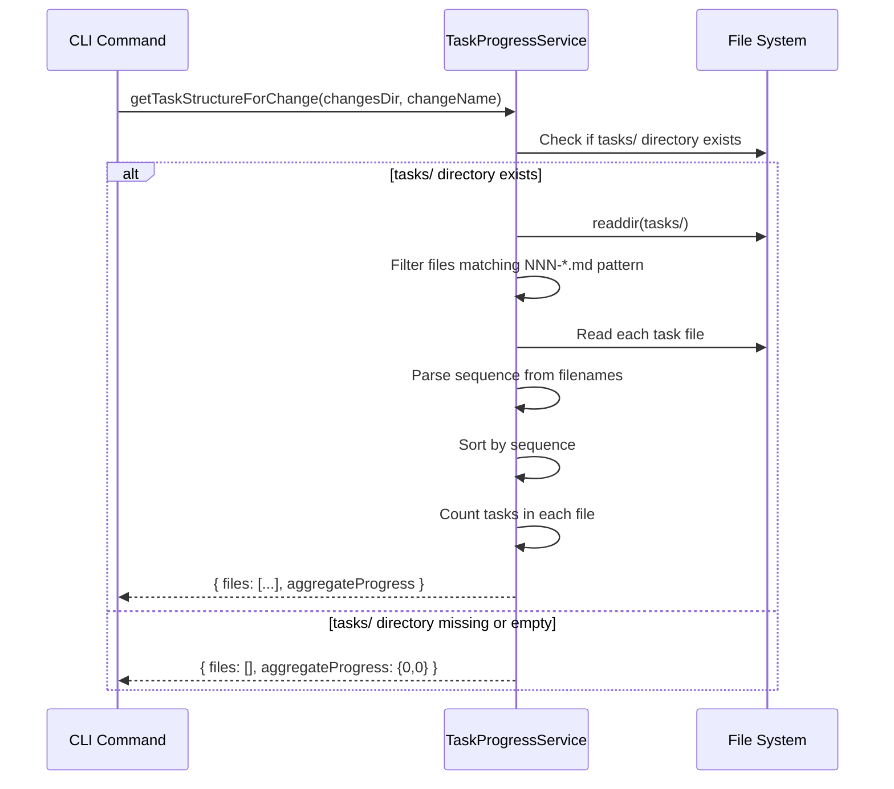
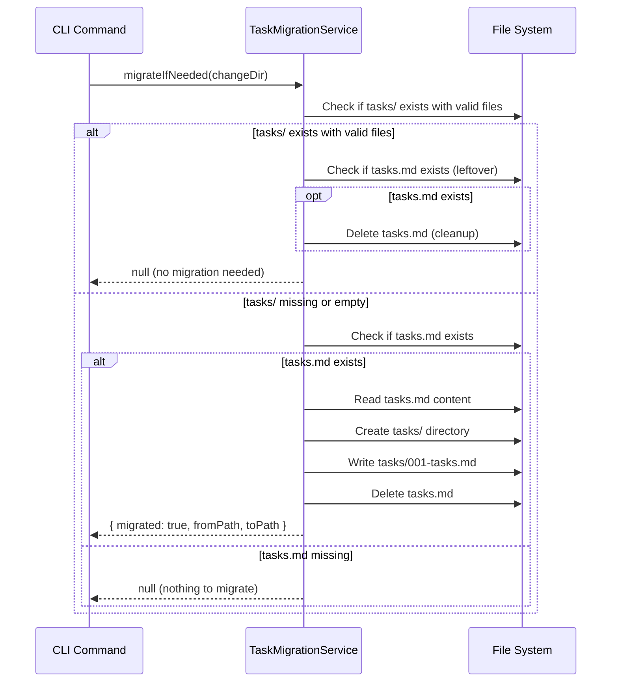

## Context

**Title**: Split tasks.md into individual task files with token-based scoping
**Linear**: [PLX-9](https://linear.app/de-app-specialist/issue/PLX-9)
**GitHub**: [#13](https://github.com/appboypov/pew-pew-plx/issues/13)
**Complexity**: 8 (Complex)

This change addresses the limitation of storing all tasks in a single `tasks.md` file. When tasks are large or numerous, the entire file must be loaded into AI conversation context, potentially exceeding token limits and making it difficult to work on individual tasks in isolation.

## Goals / Non-Goals

**Goals**:
- Token-scoped tasks: Each task file completable within 100k-120k token context
- Independent actionability: Each task can be picked up, worked on, and finished independently
- Auto-migration: Seamless transition from legacy `tasks.md` to new `tasks/` structure
- Backward compatibility: Existing changes continue to work via auto-migration

**Non-Goals**:
- Token counting/estimation (AI responsibility, not CLI)

## Decisions

1. **Naming convention**: `NNN-<kebab-case-name>.md` (three-digit prefix for sorting)
2. **tasks.md deprecated**: Only tasks/ directory supported going forward
3. **Auto-migration**: CLI auto-migrates tasks.md → tasks/001-tasks.md on first access
4. **Migration output**: Print info message when migration occurs (e.g., "Migrated tasks.md → tasks/001-tasks.md")
5. **Aggregate progress**: Sum of all task files' progress
6. **Minimum files**: Guideline of 3 (implementation, review, test) but not enforced by CLI
7. **Task file template**: End Goal, Currently, Should, Constraints, Acceptance Criteria, Implementation Checklist, Notes
8. **AGENTS.md scope**: Updates to AGENTS.md are included in this change

## Architecture Overview

### File Structure Convention

```
workspace/changes/<change-name>/
├── proposal.md
├── design.md (optional)
├── specs/ (delta specs)
└── tasks/
    ├── 001-implement-core.md
    ├── 002-implement-cli.md
    ├── 003-review.md
    └── 004-test.md
```

### Task File Template

Each task file follows this structure:

```markdown
# Task: <descriptive-title>

## End Goal

<What this task accomplishes>

## Currently

<Current state before this task>

## Should

<Expected state after this task>

## Constraints

- [ ] Constraint 1
- [ ] Constraint 2

## Acceptance Criteria

- [ ] Criterion 1
- [ ] Criterion 2

## Implementation Checklist

- [ ] Step 1
- [ ] Step 2
- [ ] Step 3

## Notes

<Additional context if needed>
```

**Task Counting Rule**: Checkboxes under `## Constraints` and `## Acceptance Criteria` are ignored when calculating task progress.

## Implementation Details

### Services

#### TaskProgressService (Modified)

**Current State**: `src/utils/task-progress.ts` - utility functions, not a service class

**New State**: Extend to support directory-based task files

```typescript
// Existing interface remains unchanged
export interface TaskProgress {
  total: number;
  completed: number;
}

// Task file metadata interface
export interface TaskFileInfo {
  filename: string;          // e.g., "001-implement-schema.md"
  filepath: string;          // full path
  sequence: number;          // extracted from prefix (1, 2, 3...)
  name: string;              // descriptive part without prefix
  progress: TaskProgress;    // task counts within this file
}

// Change task structure info
export interface ChangeTaskStructure {
  files: TaskFileInfo[];     // ordered by sequence
  aggregateProgress: TaskProgress;
}
```

**Public Methods**:

| Method | Parameters | Returns | Description |
|--------|-----------|---------|-------------|
| `getTaskStructureForChange` | `changesDir: string, changeName: string` | `Promise<ChangeTaskStructure>` | Detects task structure (single file or directory) and returns ordered task files with progress |
| `countTasksFromContent` | `content: string` | `TaskProgress` | Unchanged - counts tasks in markdown content |
| `getTaskProgressForChange` | `changesDir: string, changeName: string` | `Promise<TaskProgress>` | Modified - aggregates across all task files |
| `formatTaskStatus` | `progress: TaskProgress` | `string` | Unchanged |

**Flow Diagram**:


#### TaskMigrationService (New)

**Location**: `src/utils/task-migration.ts`

**Purpose**: Auto-migrate legacy tasks.md to tasks/ directory structure

```typescript
export interface MigrationResult {
  migrated: boolean;
  fromPath: string;
  toPath: string;
}
```

**Public Methods**:

| Method | Parameters | Returns | Description |
|--------|-----------|---------|-------------|
| `migrateIfNeeded` | `changeDir: string` | `Promise<MigrationResult \| null>` | Checks for tasks.md without tasks/, migrates if needed |
| `migrate` | `changeDir: string` | `Promise<MigrationResult>` | Forces migration of tasks.md to tasks/001-tasks.md |

**Migration Logic**:
1. Check if `tasks/` directory exists with valid files → no migration needed
2. Check if `tasks.md` exists → migrate
3. Create `tasks/` directory
4. Move `tasks.md` content to `tasks/001-tasks.md`
5. Delete `tasks.md`
6. Return migration result

**Flow Diagram**:


### Utils

#### TaskFileParser (New)

**Location**: `src/utils/task-file-parser.ts`

```typescript
export function parseTaskFilename(filename: string): { sequence: number; name: string } | null

export function sortTaskFilesBySequence(files: string[]): string[]

export function generateTaskFilename(sequence: number, name: string): string
```

### Constants

```typescript
// src/utils/task-progress.ts
export const TASK_FILE_PREFIX_PATTERN = /^(\d{3})-(.+)\.md$/;
export const TASKS_DIRECTORY_NAME = 'tasks';
export const MINIMUM_REQUIRED_TASKS = 3;
```

### CLI Command Modifications

| Command | Modification |
|---------|-------------|
| `list` | Use aggregate progress from all task files; trigger migration if needed |
| `archive` | Move entire tasks/ directory; show aggregate progress; trigger migration if needed |
| `show` | Display task file list; trigger migration if needed |
| `validate` | Validate each task file individually; trigger migration if needed |

### AGENTS.md Updates Required

1. **Stage 2: Implementing Changes** (lines 49-57)
   - Update "Read tasks.md" → "Read task files from tasks/ directory"
   - Update checklist format examples

2. **Task Creation Instructions** (lines 233-240)
   - Replace tasks.md template with tasks/ directory structure
   - Add task file template with required sections
   - Document minimum 3 files: implementation, review, test

3. **File Structure Documentation**
   - Update change directory structure to show tasks/ instead of tasks.md

4. **Task File Template** (new section)
   - Document the End Goal, Currently, Should, etc. sections
   - Explain sequential numbering convention (001-, 002-, etc.)

## TDD Gherkin Tests

### Task Progress with Tasks Directory

```gherkin
Feature: Task Progress Service supports tasks directory

  Scenario: Detect task files in tasks directory
    Given a change "my-change" has tasks/ directory with files
    When getTaskStructureForChange is called
    Then files should be ordered by sequence number

  Scenario: Aggregate progress across multiple task files
    Given a change with tasks/ containing:
      | file | completed | total |
      | 001-impl.md | 3 | 5 |
      | 002-review.md | 0 | 2 |
      | 003-test.md | 1 | 3 |
    When getTaskProgressForChange is called
    Then completed should be 4
    And total should be 10

  Scenario: Ignore checkboxes under Constraints and Acceptance Criteria
    Given a task file with:
      | section | checkboxes |
      | Constraints | 3 unchecked |
      | Acceptance Criteria | 5 unchecked |
      | Implementation Checklist | 4 unchecked |
    When task progress is calculated
    Then checkboxes under Constraints are ignored
    And checkboxes under Acceptance Criteria are ignored
    And total should be 4

  Scenario: Extract sequence and name from filename
    Given a task file named "001-implement-core-logic.md"
    When TaskFileInfo is created
    Then sequence should be 1
    And name should be "implement-core-logic"

  Scenario: Empty tasks directory returns empty structure
    Given a change with empty tasks/ directory
    When getTaskStructureForChange is called
    Then files array should be empty
    And aggregateProgress should be {0, 0}

  Scenario: Missing tasks directory returns empty structure
    Given change "my-change" has no "tasks/" directory
    When task progress is calculated for "my-change"
    Then files array is empty
    And aggregate progress is {0, 0}

  Scenario: Parse sequence from task filename
    Given a filename "003-write-unit-tests.md"
    When the filename is parsed
    Then sequence is 3
    And name is "write-unit-tests"

  Scenario: Invalid filename format is rejected
    Given a filename "no-prefix.md"
    When the filename is parsed
    Then parse result is null

  Scenario: Aggregate progress sums all task files
    Given tasks/ contains:
      | filename | completed | total |
      | 001-a.md | 2 | 5 |
      | 002-b.md | 3 | 3 |
    When aggregate progress is calculated
    Then completed is 5
    And total is 8

  Scenario: Files without valid prefix are ignored
    Given tasks/ contains:
      | filename |
      | 001-valid.md |
      | README.md |
      | notes.txt |
    When task structure is retrieved
    Then only "001-valid.md" is included
```

### Auto-migration of tasks.md to tasks directory

```gherkin
Feature: Auto-migration of tasks.md to tasks directory

  Scenario: Migrate tasks.md when tasks/ does not exist
    Given change "legacy" has tasks.md with content
    And change "legacy" has no tasks/ directory
    When migrateIfNeeded is called
    Then tasks/ directory is created
    And tasks/001-tasks.md contains original content
    And tasks.md is deleted
    And migrated is true

  Scenario: Skip migration when tasks/ already exists
    Given change "modern" has tasks/ with valid files
    And change "modern" also has tasks.md (leftover)
    When migrateIfNeeded is called
    Then no migration occurs
    And tasks.md is deleted (cleanup)

  Scenario: Skip migration when neither exists
    Given change "empty" has no tasks.md
    And change "empty" has no tasks/ directory
    When migrateIfNeeded is called
    Then result is null

  Scenario: Preserve task content during migration
    Given tasks.md contains checkboxes with mixed completion
    When migration occurs
    Then 001-tasks.md has identical content
    And checkbox states are preserved
```

### Archive Command with Task Directory

```gherkin
Feature: Archive command handles task directories

  Scenario: Archive moves entire tasks directory
    Given change "my-change" has tasks/ directory with 3 files
    When archive command is executed for "my-change"
    Then the entire tasks/ directory is moved to archive
    And all task files are preserved

  Scenario: Archive shows aggregate progress from directory
    Given change "my-change" has tasks/ with mixed completion
    When archive command displays task status
    Then aggregate progress is shown
```

### List Command with Task Directory

```gherkin
Feature: List command shows aggregate task progress

  Scenario: List shows combined progress from tasks directory
    Given change "my-change" has tasks/ with 3 files
    And total aggregate is 4/10 tasks
    When list command is executed
    Then "my-change" shows "4/10 tasks"

  Scenario: List shows no tasks for empty tasks directory
    Given change "empty-change" has empty tasks/ directory
    When list command is executed
    Then "empty-change" shows "No tasks"
```

## E2E Tests

### E2E: Full workflow with task directory

```gherkin
Feature: End-to-end task directory workflow

  Scenario: Create, work, and archive change with task directory
    Given I run "plx init" in a new project
    And I create change "add-feature" with tasks/ directory containing:
      | 001-implement.md | 3 tasks |
      | 002-review.md | 2 tasks |
      | 003-test.md | 2 tasks |
    When I run "plx list"
    Then I see "add-feature" with "0/7 tasks"
    When I mark all tasks in 001-implement.md complete
    And I run "plx list"
    Then I see "add-feature" with "3/7 tasks"
    When I mark all remaining tasks complete
    And I run "plx archive add-feature -y"
    Then change is archived with all task files preserved
    And archive contains tasks/ directory with 3 files
```

### E2E: Auto-migration of legacy tasks.md

```gherkin
Feature: Auto-migration of legacy tasks.md

  Scenario: Legacy change with tasks.md is auto-migrated
    Given existing change "legacy-change" has tasks.md with 5 tasks
    And "legacy-change" has no tasks/ directory
    When I run "plx list"
    Then I see "Migrated tasks.md → tasks/001-tasks.md"
    And tasks/ directory is created with 001-tasks.md
    And tasks.md is deleted
    And "legacy-change" shows "0/5 tasks"
```

## Risks / Trade-offs

| Risk | Mitigation |
|------|------------|
| Breaking existing workflows | Auto-migration handles legacy changes transparently |
| File system overhead with many task files | Task files are small; file system operations remain fast |
| Complexity in tracking progress | Aggregate progress logic is straightforward sum |
| Learning curve for new structure | Documentation and templates guide users |

## Open Questions

None - all decisions finalized in refinement.
