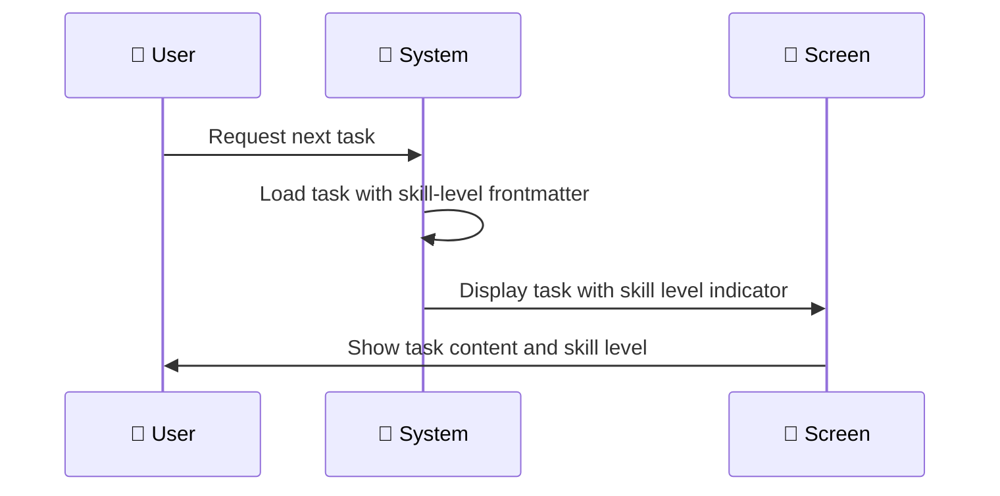
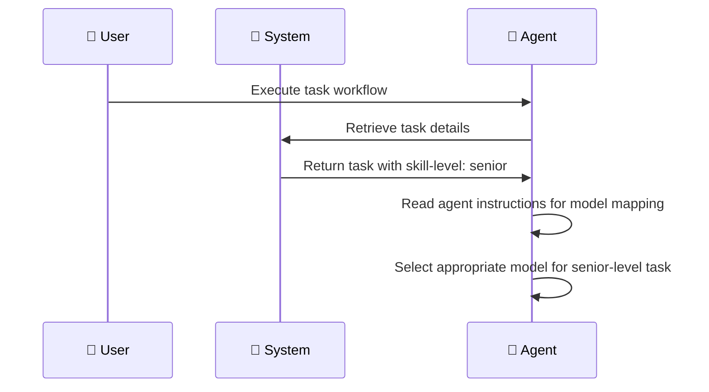

# ✨ Task includes skill level indicator for AI model selection

## End goal

Tasks include a skill level classification (junior/medior/senior) that AI agents use to select the appropriate model for execution.

## Currently

All tasks are treated equally regardless of complexity. AI agents have no guidance on which model to use for different task types.

## Should

* Each task has a skill level field in its frontmatter (junior, medior, or senior)
* AI agents receive clear instructions on how to map skill levels to model selection
* The skill level reflects the complexity and expertise required for the task
* The plx/orchestrate command should be updated to instruct to choose the appropriate model based on task level if present, otherwise determine itself

## Constraints

* Skill levels are limited to three tiers: junior, medior, senior
* The skill level is set at task creation time
* Model selection guidance is provided to agents, not enforced by the system

## Acceptance Criteria

* Task frontmatter supports a `skill-level` field with values: junior, medior, senior
* Agent instructions document the mapping between skill levels and recommended models
* Existing tasks without skill level continue to work (field is optional)

## Scenarios

### Scenario: Agent retrieves task with skill level

### Scenario: Agent selects model based on skill level

## Metadata
- URL: [https://linear.app/de-app-specialist/issue/PLX-46/task-includes-skill-level-indicator-for-ai-model-selection](https://linear.app/de-app-specialist/issue/PLX-46/task-includes-skill-level-indicator-for-ai-model-selection)
- Identifier: PLX-46
- Status: To Do
- Priority: No priority
- Assignee: Brian Manuputty
- Cycle: Cycle 13 (#2)
- Created: 2026-01-04T13:23:03.117Z
- Updated: 2026-01-04T13:28:34.681Z

## Pull requests

- [#73 ✨ Task includes skill level indicator for AI model selection](https://github.com/appboypov/pew-pew-plx/issues/73)

## Comments

- GitHub integration:

  This comment thread is synced to a corresponding [GitHub issue](https://github.com/appboypov/pew-pew-plx/issues/73). All replies are displayed in both locations.