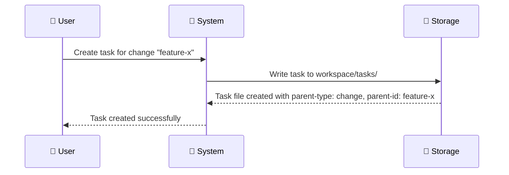
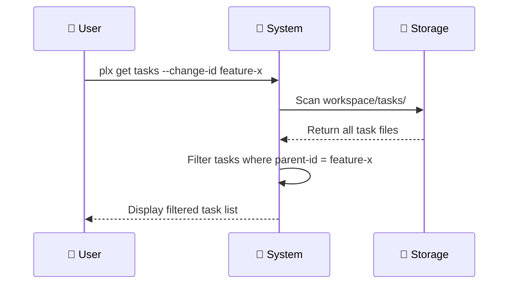
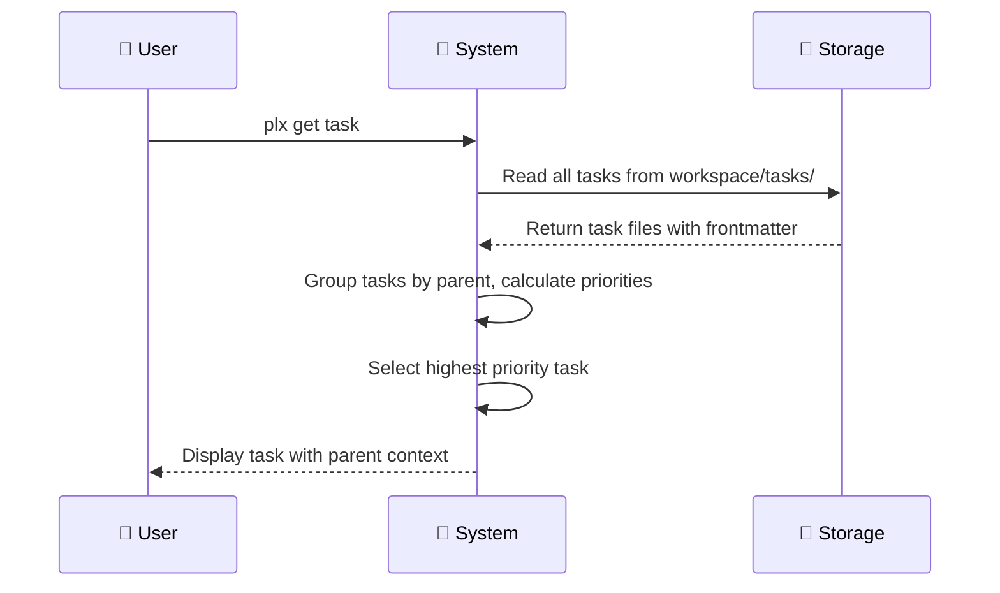

# 🧱 Refactor task storage to use centralized workspace/tasks/ folder with parent linking

## End goal

Tasks are stored in a single `workspace/tasks/` folder rather than nested within change or review folders, with frontmatter linking each task to its parent entity.

## Currently

Tasks are stored inside their parent entity folders:

* `workspace/changes/<change-name>/tasks/`
* `workspace/reviews/<review-name>/tasks/`

## Should

* All tasks reside in `workspace/tasks/`
* Each task file contains frontmatter that links to its parent entity (change or review)
* The system retrieves, filters, and manages tasks based on their parent link
* Existing functionality (get task, complete, undo, progress tracking) continues to work using the parent relationship

## Constraints

* Task filenames must remain unique across the entire tasks folder
* Parent entity type and ID must be clearly identifiable from task frontmatter
* Migration path needed for existing task structuresd

## Acceptance Criteria

- [ ] Tasks are created in `workspace/tasks/` regardless of parent type
- [ ] Task frontmatter includes parent-type and parent-id fields
- [ ] `plx get task` retrieves tasks filtered by parent when applicable
- [ ] `plx get tasks --change-id <id>` returns tasks linked to that change
- [ ] Task completion and undo commands work with centralized storage
- [ ] Progress tracking aggregates correctly per parent entity

## Scenarios

### Scenario: Creating a task for a change

### Scenario: Retrieving tasks for a specific change

### Scenario: Getting next prioritized task

## Metadata
- URL: [https://linear.app/de-app-specialist/issue/PLX-44/refactor-task-storage-to-use-centralized-workspacetasks-folder-with](https://linear.app/de-app-specialist/issue/PLX-44/refactor-task-storage-to-use-centralized-workspacetasks-folder-with)
- Identifier: PLX-44
- Status: To Assess
- Priority: No priority
- Assignee: Brian Manuputty
- Cycle: Cycle 14 (#3)
- Created: 2025-12-30T18:22:39.198Z
- Updated: 2026-01-05T12:13:11.996Z

## Pull requests

- [#66 🧱 Refactor task storage to use centralized workspace/tasks/ folder with parent linking](https://github.com/appboypov/pew-pew-plx/issues/66)

## Comments

- GitHub integration:

  This comment thread is synced to a corresponding [GitHub issue](https://github.com/appboypov/pew-pew-plx/issues/66). All replies are displayed in both locations.